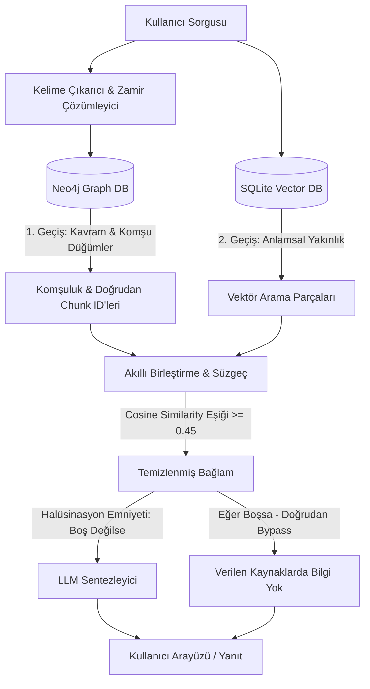

# 🧠 HERMES: Hybrid Graph-Vector RAG System
> **Proof of Concept (POC) - State-of-the-Art Cognitive RAG & Mind Map Visualizer**

*Projenin Tanıtımı için:* https://www.youtube.com/watch?v=QxzEzFsMGpo&t=57s


HERMES, geleneksel RAG (Retrieval-Augmented Generation) sistemlerinin yapısal veri ilişkilerini ve bağlamsal köprüleri kuramama sorununu çözen, **Vektör Arama (SQLite)** ile **Bilgi Grafı (Neo4j)** teknolojilerini birleştiren yeni nesil bir **Hibrit RAG ve Zihin Haritası Görselleştirme** platformudur.

Uygulama, yerel yapay zeka modelleri (Ollama) ile kurumsal düzeydeki veritabanı entegrasyonlarını tamamen yerel (offline-first) ve interaktif bir PyQt6 masaüstü arayüzünde sunar.

---

## 📐 Sistem Mimarisi

HERMES, çok katmanlı ve iki geçişli bir arama (Two-Pass Retrieval) mimarisi kullanır:



---

## ✨ Öne Çıkan Gelişmiş Özellikler

### 1. 🔍 Çift Geçişli Hibrit Arama (Graph-Vector Fusion)
Sistem, sorguları hem anlamsal (vektör) hem de yapısal (graf) boyutlarda arar:
* **Vektör Arama**: SQLite üzerinde saklanan metin parçaları ile sorgu arasındaki anlamsal yakınlığı ölçer.
* **Graf Arama**: Neo4j veritabanındaki kavramları, ilişkileri ve organizasyon şemasını sorgular.

### 2. 🛡️ Halüsinasyon Kalkanı (Hallucination Guard)
RAG projelerindeki en büyük sorun olan yapay zekanın "uydurma" (hallucination) eğilimi iki aşamalı olarak engellenir:
* **Benzerlik Eşiği (Similarity Threshold)**: Cosine similarity değeri **0.45**'in altında kalan alakasız dosyalar/metinler otomatik olarak elenir.
* **Sentez Bypass (Bypass LLM)**: Arama sonucunda veritabanında hiçbir ilgili kavram veya metin bulunamazsa, LLM çağrısı tamamen atlanarak saliseler içinde güvenli olumsuz yanıt (`"Verilen kaynaklarda bu bilgi bulunmamaktadır."`) döndürülür.

### 3. 🧠 Dinamik Sohbet Belleği ve Zamir Çözümleme
Sohbet penceresi tamamen bağlam farkındalıklı (context-aware) çalışır:
* **Zamir Çözümleme**: Kullanıcı *"Oktavis nedir?"* dedikten sonra *"Peki **bunu** kim kurdu?"* diye sorduğunda, sistem sohbet geçmişine bakarak **"bunu"** kelimesinin **"Oktavis"** olduğunu anlar ve graf aramasını buna göre günceller.
* **Hafıza Yönetimi**: Sistem performansı için konuşma geçmişi son 10 mesajla sınırlandırılmıştır.

### 4. 🔗 Otomatik Kavram İlişkilendirme (Entity Resolution)
Veri yükleme (ingestion) aşamasında, farklı belgelerde geçen benzer kavramlar (örn: `Oktavis` ve `Oktavis Case Study`) Neo4j üzerinde otomatik olarak saptanır ve aralarında bir **`[:RELATES_TO]`** ilişkisi kurulur. Bu sayede farklı dokümanlar graf üzerinden **birbiriyle konuşmaya başlar**.

### 5. 🌐 Graf Komşuluğu Boyunca Arama (Neighborhood Retrieval)
Bir kavram sorgulandığında, sistem sadece o kavramın metinlerini değil, graf üzerinde ona bağlı olan **1-hop mesafedeki komşu düğümlerin metinlerini de** otomatik olarak toplar. Bu durum, soruların bir belgede, cevapların ise başka bir belgede olduğu senaryolarda doğru cevaba ulaşmayı garantiler.

### 6. 📁 Yapısal Proje & Belge Sorguları
Eğer sorgu doğrudan bir projenin adı (örn: *"deus projesi"*) veya doküman adı ise, sistem Neo4j üzerinden projeye bağlı tüm dokümanların ID'lerini çözer ve SQLite'tan bu belgelere ait tüm içeriği doğrudan çekerek LLM'e sunar.

---

## 🛠️ Teknoloji Yığını

* **Frontend**: PyQt6 (Özelleştirilmiş premium koyu tema, interaktif HTML sohbet balonları)
* **Graf Veritabanı**: Neo4j (İlişkisel şema, kavram haritası, organizasyon ağacı)
* **Vektör Veritabanı**: SQLite + Cosine Similarity (Gömme vektörleri ve metin parçaları)
* **Yapay Zeka Modelleri (Yerel - Ollama)**:
  * Kelime Çıkarımı: `qwen3:4b`
  * Gömme (Embedding): `qwen3-embedding:4b`
  * Sentezleme (Synthesis): `gpt-oss:120b-cloud` (veya seçilen herhangi bir Ollama modeli)

---

## ⚙️ Kurulum ve Çalıştırma

### Gereksinimler
* Python 3.10+
* Neo4j Desktop veya Neo4j Server (Yerel veya AuraDB Bulut)
* Ollama (Gerekli yerel modeller yüklenmiş olmalıdır)

### Kurulum Adımları

1. Depoyu klonlayın ve proje dizinine gidin:
   ```bash
   cd HERMES
   ```

2. Gerekli Python kütüphanelerini yükleyin:
   ```bash
   pip install PyQt6 neo4j ollama numpy
   ```

3. Ollama modellerini bilgisayarınıza indirin:
   ```bash
   ollama pull qwen3:4b
   ```

4. Yerel Neo4j veritabanınızı başlatın.

5. Uygulamayı çalıştırın:
   ```bash
   python main_gui.py
   ```

6. Uygulama açıldığında sağ taraftaki **Ayarlar (Settings)** sekmesinden Neo4j bağlantı adresinizi ve şifrenizi girip kaydedin. Aynı ekrandan modelinizin **Bağlam Uzunluğunu (Context Length)** `8192` veya `16384` olarak yapılandırabilirsiniz.

---

## 📖 Kullanıcı Kılavuzu

1. **Doküman Yükleme**: Sol panelden bir PDF dosyası seçin. Yükleme sırasında açılan pencerede **Yükleyen Kişi, Proje Adı, Şirket Adı** gibi meta bilgileri girin. Bu bilgiler belgenin graf üzerinde doğru konumlandırılmasını sağlar.
2. **Sohbet (RAG)**: Yapay zekaya doğrudan sorularınızı yöneltin. Cevapların altında yer alan **"Referans Kaynaklar"** kısmından, bilginin hangi belgeden, kim tarafından, ne zaman yüklendiğini görebilir ve dosya yoluna tıklayarak doğrudan bilgisayarınızda açabilirsiniz.
3. **Kavram Haritası**: "Kavram Haritası" sekmesinde verilerinizin birbirine nasıl bağlandığını görsel bir zihin haritası olarak izleyin. Harita üzerinde bir düğüme tıkladığınızda sağ panelde o düğümün detaylarını görebilir ve tek tıkla o kavram hakkında soru sorabilirsiniz.
4. **Sohbeti Temizleme**: Sağ üstteki **"Sohbeti Temizle"** butonuna basarak ekranı sıfırlayabilir ve arka plandaki RAG hafızasını temizleyebilirsiniz.
